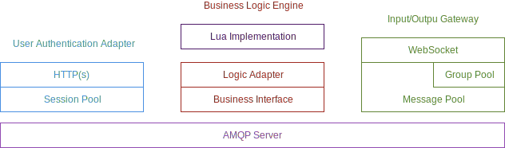

JoyEngine
===
A scalable, distributed high-available online game server framework

## Build

Use Visual Studio 2017, Xamarin Studio or MonoDevelop to build it.

You can also build it with [Mono C# Compiler](http://www.mono-project.com/docs/about-mono/languages/csharp) or [.NET Core](http://dotnet.github.io/).

## About Lua

JoyEngine uses a Lua implementation for the .net Dynamic Language Runtime (DLR) named [MoonSharp](https://github.com/xanathar/moonsharp), the implementation is on the level of [Lua 5.2](http://www.lua.org/manual/5.2/manual.html) now.

## Components

* [ ] Anti-Cheating Plugin (ACP)
    * [ ] Server-side Data Validation
* [ ] Bussiness Logic Engine (BLE)
    * [ ] Database Support
    * [ ] Hook Support
    * [ ] Lua Virtual Machine
    * [ ] Tick Support
* [x] Input/Ouput Gateway (IOG)
    * [x] Group Management
    * [x] Incoming/Outgoing Messages Routing
    * [x] Websocket Connector
* [ ] Management RPC Server (RPC)
    * [ ] Management APIs
* [ ] System Monitor Daemon (MON)
    * [ ] Nodes Dispatching
    * [ ] Status Monitoring
* [ ] User Authentication Adapter (UAA)
    * [ ] Session Management
    * [ ] User Authentication
* [ ] Toolchain
    * [ ] Script Editor (for BLE)
    * [ ] Tool to create Data Schemas (for BLE and DBI)
    * [ ] Tool to create Message Schemas (for MGW)

## Contributing

Contributions are welcome and can be submitted using pull requests.

Please follow the guidelines in our [CONTRIBUTING](CONTRIBUTING.md) guide.

## License

JoyEngine is dual licensed under the GNU GENERAL PUBLIC LICENSE V3 or a commercial license. If you cannot accept GPL, you need to obtain a commercial license.

More info see [LICENSE](LICENSE).

#### There're some third-party libraries used by our project, they are:

##### [RabbitMQ.Client](https://github.com/rabbitmq/rabbitmq-dotnet-client) (NuGet package)

the [Apache License v2](https://raw.githubusercontent.com/rabbitmq/rabbitmq-dotnet-client/master/LICENSE-APACHE2) and the [Mozilla Public License v1.1](https://raw.githubusercontent.com/rabbitmq/rabbitmq-dotnet-client/master/LICENSE-MPL-RabbitMQ)

##### [Newtonsoft.Json](https://github.com/JamesNK/Newtonsoft.Json) (NuGet package)

the [MIT License](https://raw.githubusercontent.com/JamesNK/Newtonsoft.Json/master/LICENSE.md)

##### [Google.Protobuf](https://github.com/google/protobuf/tree/master/csharp) (NuGet package)

the [3-Clause BSD license](https://raw.githubusercontent.com/google/protobuf/master/LICENSE)

##### [MoonSharp](https://github.com/xanathar/moonsharp) (NuGet package)

the [3-Clause BSD license](https://github.com/xanathar/moonsharp/blob/master/LICENSE)

##### [StackExchange.Redis](https://github.com/StackExchange/StackExchange.Redis) (NuGet package)

the [MIT License](https://github.com/StackExchange/StackExchange.Redis/blob/master/LICENSE)
